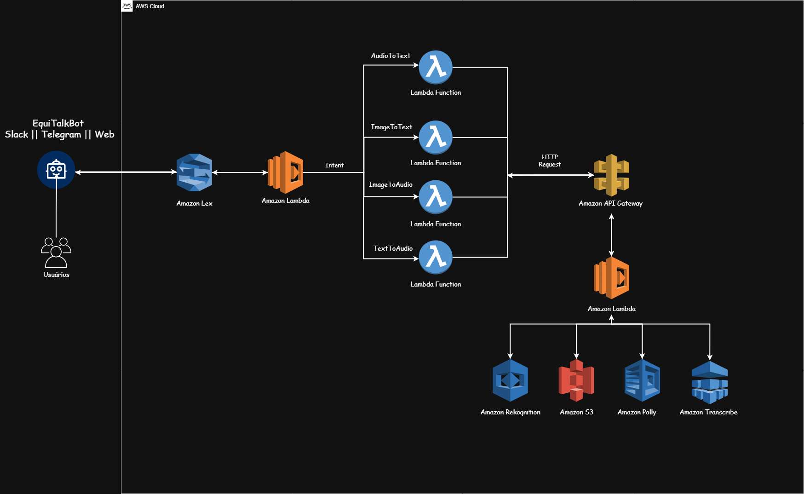

  <h1>EquiTalk Bot</h1>

  
Equipe 1

  | Nome                                 | Linkedin                                                                                 |
  | ---------------                      | -------------------------------------------------------------------                      |
  | John Marcel   | [Link](https://www.linkedin.com/in/john-marcel-silveira-62530752/)    |
  | Josué Fernandes                 | [Link](https://www.linkedin.com/in/josu%C3%A9-mendon%C3%A7a-dev77/)                             |
  | Yuri Souza                       | [Link](https://www.linkedin.com/in/yuri-antunes-souza/)                      |    
  | Luiz Scarsi           | [Link](https://www.linkedin.com/in/luiz-augusto-scarsi/)                |      

***

## 📖 Sumário
- [1 - Objetivo](#ancora1)
- [2 - Funcionalidades](#ancora2)
- [3 - Desenvolvimento do Projeto](#ancora3)
- [4 - Acesso à Aplicação e Como Utilizá-la](#ancora4)
- [5 - Estrutura de Pastas do Projeto](#ancora5)
- [6 - Arquitetura AWS](#ancora6)
- [7 - Dificuldades conhecidas](#ancora7)
- [8 - Licença](#ancora8)

# 1 - Objetivo

O ``EquiTalk`` é uma inovadora solução de software que unifica os três principais modos de comunicação utilizados no mundo real: ``fala``, ``texto`` e ``visualização``. Sua missão é alcançar a maior audiência possível, criando um ambiente verdadeiramente acessível para todos os usuários. Ao integrar essas formas de linguagem, o ``EquiTalk`` não apenas amplia a acessibilidade, mas também capacita os usuários a terem sua voz na narrativa global. 
    

# 2 - Funcionalidades
  - *Conversor de `Texto` para `Áudio`*
      - **Exemplos de Casos de Uso**
          - Auxílio para pessoas com deficiência visual.
          - Auxílio para pessoas em processo de alfabetização.

      - **Implementação**         
          - Através do serviço ``Amazon Polly`` será gerado um áudio no ``S3`` do determinado texto para o usuário.
    
  - Conversor de `Imagem` para `Áudio`
    - **Exemplos de Casos de Uso**
      - Auxílio para pessoas com deficiência visual.
      - Auxílio para pessoas em processos de aprendizagem (Resumos).

    - **Implementação**
      - Através do serviço ``Amazon Rekognition`` Text in Image e do ``Amazon Polly`` será gerado um áudio no ``S3`` do determinado texto na imagem para o usuário.
  
  - Conversor de `Imagem` para `Texto`
    - **Exemplos de Casos de Uso**
      - Auxílio para pessoas em processos de aprendizagem (Resumos).
      - Digitalização de Documentos.

    - **Implementação**    
      - Através do serviço ``Amazon Rekognition`` será gerado o texto referente a determinada imagem para o usuário.
                
  - Conversor de `Áudio` para `Texto`
    - **Exemplos de Casos de Uso**
      - Auxílio para pessoas com deficiência auditíva.
      - Auxílio para pessoas em processos de aprendizagem (Podcast, Video Aulas).

    - **Implementação**
      - Através do serviço ``Amazon Transcribe`` será gerado o texto referente ao determinado áudio para o usuário.
<!-- 

# 3 - Desenvolvimento do Projeto -->

<!-- 

# 4 - Acesso à Aplicação e Como Utilizá-la

# 5 - Estrutura de Pastas do Projeto -->

# 6 - Arquitetura AWS

  

    
  

***

<!-- 

# 7 - Dificuldades conhecidas -->

# 8 - Licença

Este projeto está licenciado sob a Licença MIT - consulte o [Link](https://mit-license.org/) para obter mais detalhes.